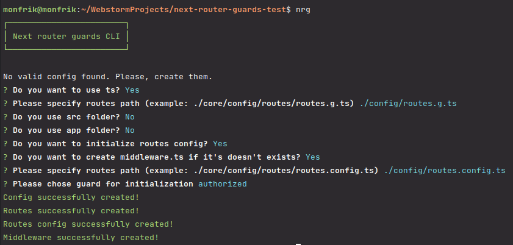
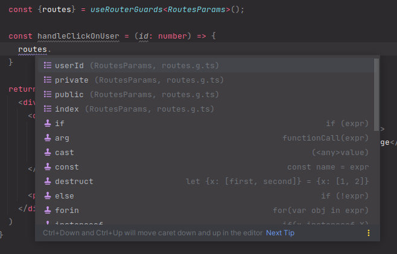
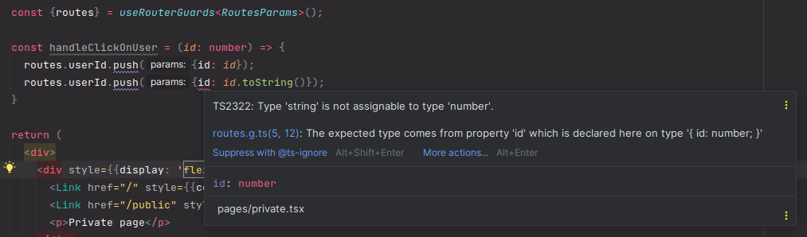

# next-router-guards [](https://www.npmjs.com/package/next-router-guards)

A library for secure routes in your web project.

The security depend on next [middleware](https://nextjs.org/docs/advanced-features/middleware), so it improve performance.

## Comparison
Why use the next-router-guards is better than alternatives?
1) Performance. It's executing faster than use `useEffect` inside of page, because checking for access to the page occurs on the server side.
2) Data safety. When we use `useEffect` (or other ways to protect pages based on client side conditions) user can see private data in network, and also user can see the private page before he will be relocated to another page.
3) All page access settings will be in one place.

Example of using next-router-guards.


Example of using useEffect.


## Requirements
This package has the following peer dependencies:

- [React](https://reactjs.org/) v18.2.0+
- [Next](https://nextjs.org/) v13.0.7+

## Install
```bash
npm i next-router-guards
```

## Usage
Here is a very basic example of how to use Next Router Guards.

Example of pages:


### Manually
1) Create `routes` and `RoutesParams` for show which params you need to pass for go to the page.
Example:
```ts
// /config/routes.g.ts

export type RoutesParams = {
  index: null,
  private: null,
  public: null,
  userId: {id: number},
};

export const routes: {readonly [key in keyof RoutesParams]: string} = {
  index: '/',
  private: '/private',
  public: '/public',
  userId: '/user/[id]',
};
```
2) Create routes config with existing guard (You can see examples of guards in [/examples](https://github.com/makskiyko/next-router-guards/tree/master/exmaples)).
Example:
```ts
// /config/routes.config.ts

import {AuthorizedGuard} from 'next-router-guards';

import {routes, type RoutesParams} from './routes.g';

export const routesConfig = new AuthorizedGuard<RoutesParams>({
  routes,
  config: {
    routes: {
      index: {isPublic: true},
      public: {isPublic: true},
      private: {isPublic: false},
      userId: {isPublic: false},
    },
    defaultPublicRoute: routes.public,
    defaultPrivateRoute: routes.private,
    checkAuthorized: (request) => request.cookies.has('token'),
  },
});
```
3) BE SURE to write this code in the root of your project in `middleware.ts`.
```ts
// /middleware.ts

import type {NextRequest} from 'next/server';

import {routesConfig} from './config/routes.config';

export async function middleware(request: NextRequest) {
  return routesConfig.accessRequest(request);
}
```

### CLI
1) Install next-router-guards global
```shell
npm i next-router-guards -g
```
2) Run CLI for create initial config or for update routes and routes config depend on your files in pages folder.
```shell
nrg
```

3) Pass types into the routesParams and routesConfig values.

### Custom guard.
In both variants of using (manual or CLI) you can use your own guard with a custom logic.
If you want to create your guard:
1. Create new class extends from `Guard` with 3 generic params: (`TRoutesParams` - name of pages with their params, `TConfigProps` - config of your router. `TGuardRoute` - config of your routes).
2. Override `canAccessRoute` method to provide your logic.
3. You can also override `canAccessDefaultRoute` if you need it.
4. Make instance from your class with filled config.
Example:
```ts
// /core/services/active.guard.service.ts

import {Guard} from 'next-router-guards';
import type {CanAccessRouteParams, RouteUrl} from 'next-router-guards';
import {NextRequest} from 'next/server';

type ActiveGuardRoute = {
  isActive?: boolean | ((request: NextRequest) => boolean) | ((request: NextRequest) => Promise<boolean>);
};

type ActiveGuardConfigProps = {
  defaultPage: RouteUrl;
};

export class ActiveGuard<TRoutesParams extends RoutesParams> extends Guard<
  TRoutesParams,
  ActiveGuardConfigProps,
  ActiveGuardRoute
> {
  protected async canAccessRoute(
    params: CanAccessRouteParams<TRoutesParams, ActiveGuardConfigProps, ActiveGuardRoute>,
  ): Promise<string | null> {
    const isActive: boolean = params.route.config.isActive
      ? typeof params.route.config.isActive === 'boolean'
        ? params.route.config.isActive
        : await params.route.config.isActive(params.request)
      : true;

    return isActive ? null : params.config.defaultPage;
  }
}
```

### Additional features

#### useRouterGuards
You can use `useRouterGuards` hook for push or replace pages. What a difference between push pages with `useRouter` (from next) and `useRouterGuards` (from `next-router-guards`)?
1) When you pushing (or replacing) pages with `useRouterGuards` you can choose the pages from list of variants (if you're using typescript your IDE will pass you variants of pages based on `TRoutesParams`)

2) You must fill params of your pushing page with the correct type.


How to use:
1) Wrap your content (in _app) in RouterGuardsProvider and pass your routes const
```tsx
import type {AppProps} from 'next/app'
import {RouterGuardsProvider} from "next-router-guards";

import {routes} from "@/config/routes.g";

export default function App({Component, pageProps}: AppProps) {
  return (
    <RouterGuardsProvider routes={routes}>
      <Component {...pageProps} />
    </RouterGuardsProvider>
  )
}
```
3. Use `useRouterGuards` inside of your pages and pass `RoutesParams` generic for better IDE helping.
```tsx
const {routes} = useRouterGuards<RoutesParams>();
```

#### Combine guards
In some cases you may want to combine guards for setting access to request. For example, it can be usefully for secure pages and api.
In this case you can pass `urlRegexp` in any guard config. Create some guards with config. And call `combineGuards` in `widdleware.ts`.
Example:
```ts
import type {NextRequest} from 'next/server';
import {combineGuards} from "next-router-guards";

import {routesConfig} from './config/routes.config';
import {apiConfig} from './config/api.config';

export async function middleware(request: NextRequest) {
  return combineGuards([routesConfig, apiConfig]);
}
```

#### Recommendations
- name routes with `/*` (e.g. not found page) with `_` in start of route name. Because of all routes starts comparing with current page by alphabet.

## License
`next-router-guards` is released under the [MIT](License) license.
